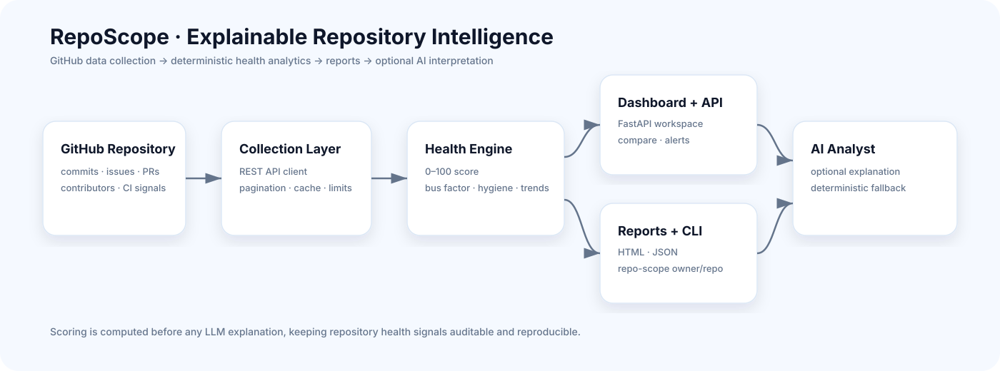

<div align="center">

# RepoScope

### Explainable repository intelligence for GitHub engineering teams

**Health scoring · contributor concentration · issue/PR hygiene · trends · comparisons · optional AI analysis**


</div>

RepoScope transforms recent GitHub activity into an **explainable repository health profile** covering activity, contributor concentration, issue and pull-request hygiene, engineering-practice signals, alerts, trends and comparisons.

The analytics layer is deterministic; optional AI interpretation sits on top of already-computed evidence.

## Architecture



## What RepoScope measures

- explainable 0–100 repository health score;
- contributor concentration and bus-factor risk;
- issue and pull-request hygiene;
- CI, tests, README, license, contributing and security-policy signals;
- monthly activity trends;
- alerts and comparison views;
- standalone HTML and JSON reports;
- CLI analysis via `repo-scope owner/repo`;
- optional AI-assisted recommendations with deterministic fallback.

## Engineering design

| Layer | Responsibility |
|---|---|
| GitHub client | Authentication, pagination, caching and rate-limit handling |
| Collection | Recent repository activity and engineering signals |
| Analytics | Health score, bus factor, hygiene, trends and alerts |
| Web/API | FastAPI dashboard, analysis and comparison endpoints |
| Reports/CLI | HTML, JSON and command-line output |
| AI analyst | Optional explanation of already-computed evidence |

## API

```text
GET  /api/health
POST /api/analyze
POST /api/compare
POST /api/ai-insight
```

## CLI

```bash
repo-scope fastapi/fastapi --html reports/fastapi.html --json reports/fastapi.json
repo-scope facebook/react --stdout
```

## Local run

Requires Python 3.12+.

```bash
cd repo-scope
python -m venv .venv
pip install -e ".[dev]"
cp .env.example .env
uvicorn app:app --reload
```

Open `http://127.0.0.1:8000` and API docs at `http://127.0.0.1:8000/docs`.

Recommended environment values:

```env
GITHUB_TOKEN=github_pat_...
OPENAI_API_KEY=
OPENAI_MODEL=gpt-5.6-luna
CACHE_TTL_SECONDS=3600
GITHUB_MAX_PAGES=3
```

`GITHUB_TOKEN` is strongly recommended for better rate limits. `OPENAI_API_KEY` is optional; without it the insight panel remains usable through deterministic summaries.

## Repository structure

```text
.
├── README.md
├── docs/
│   └── architecture-modern.svg
└── repo-scope/
    ├── app.py
    ├── public/
    ├── src/repo_scope/
    │   ├── web.py
    │   ├── profile.py
    │   ├── fetch/
    │   ├── analysis/
    │   ├── report/
    │   ├── ml/
    │   └── insights.py
    ├── scripts/
    ├── tests/
    ├── Dockerfile
    └── pyproject.toml
```

## ML path

RepoScope does **not** present an untrained classifier as a finished risk model. The repository includes a training path that should only be used after collecting and human-labelling repository snapshots.

```bash
pip install -e ".[ml]"
python scripts/export_training_row.py fastapi/fastapi --label healthy
python scripts/train_risk_model.py data/repo_risk_training.csv
```

## Deployment

The application includes Docker, Vercel and Render deployment configuration. The same container boundary can be adapted to an AWS runtime.

## Interpretation limits

Collection is deliberately capped to keep interactive analysis responsive and respectful of GitHub API limits. Metrics represent **recent sampled engineering signals**, not an exhaustive download of full repository history.

## Author

Developed and maintained by **Chaima Menouar** as an AI/software-engineering portfolio project.
